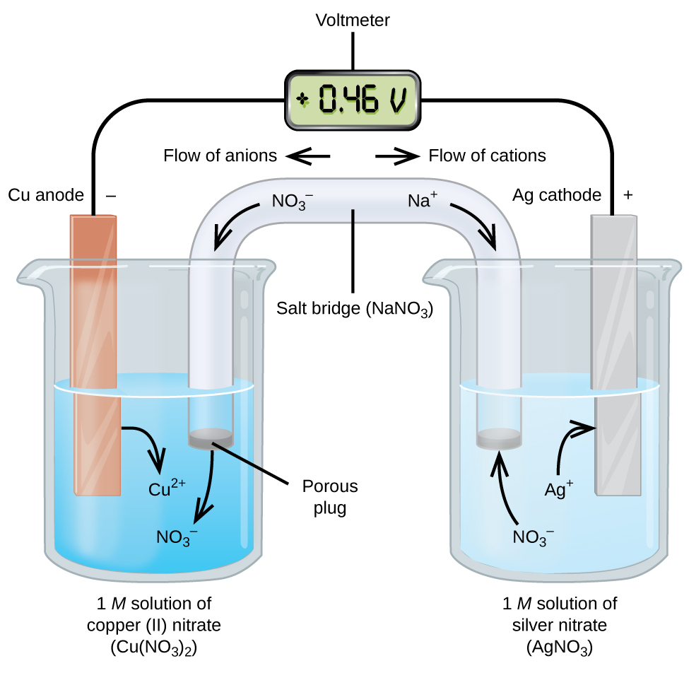

---
title: "General Chemistry"
author: [Tanvi Jakkampudi]
date: 2018-06-13
titlepage: True
titlepage-color: "999999"
titlepage-text-color: "FFFFFF"
titlepage-rule-color: "AD2317"
...

# Electrochemistry

\hrule

## Oxidation-Reduction

* In **redox** reactions, electrons are transfered from one atom to another
    * the atom that **loses** electrons is **oxidized**
    * the atom that **gains** electrons is **reduced**
    * *you can use the acronym "OIL RIG" to remember this*

## Oxidation States

* oxidation states are the **possible charge values** that an atom can hold within a molecule

| Oxidation State | Atom                                                   |
|-----------------|--------------------------------------------------------|
| 0               | Atoms in their elemental form                          |
| -1              | Flourine                                               |
| +1              | Hydrogen (except when bonded to a metal: then -1)      |
| -2              | Oxygen (except when it is in a peroxide like $H_2O_2$) |

> *Note:* in general, the oxidation is equivalent to the opposite of how many electrons the atom must acquire to have a full valence shell, hence...

{width=40%}

| Oxidation State | Group on the Periodic Table              |
|-----------------|------------------------------------------|
| +1              | Group 1 elements (alkali metals)         |
| +2              | Group 2 elements (alkaline earth metals) |
| -3              | Group 15 elements (nitrogen family)      |
| -2              | Group 16 elements (oxygen family)        |
| -1              | Group 17 elements (halogen family)       |
| 0               | Group 18 elements (noble gases)          |
 **Keep in Mind:**

 * the oxidation states of atoms in a molecule must add up to the total charge of the molecule
 * transition metals change oxidation states based on the atoms they are bonded to
 * whenever there is oxidation, there must also be reduction
 * the **reducting agent / reductant** gives electrons away to another atom (the **reducing agent** is **oxidized** in the reaction)
 * the **oxidizing agent / oxidant** accept electrons from another atom (the **oxidizing agent** is **reduced** in the reaction)

## Oxidation-Reduction Titrations

* in order to find the molarity of a reducing agent, titrate it with a strong oxidizing agent.

> *Note:* knowledge of oxidation-reduction titrations is not necessary for the MCAT, but it is possible that there will be a passage on them.

## Potentials

